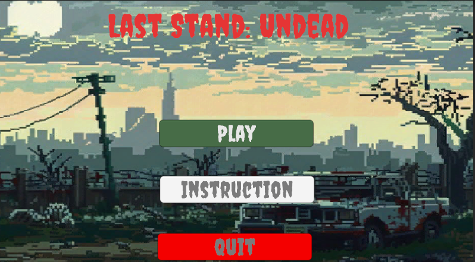
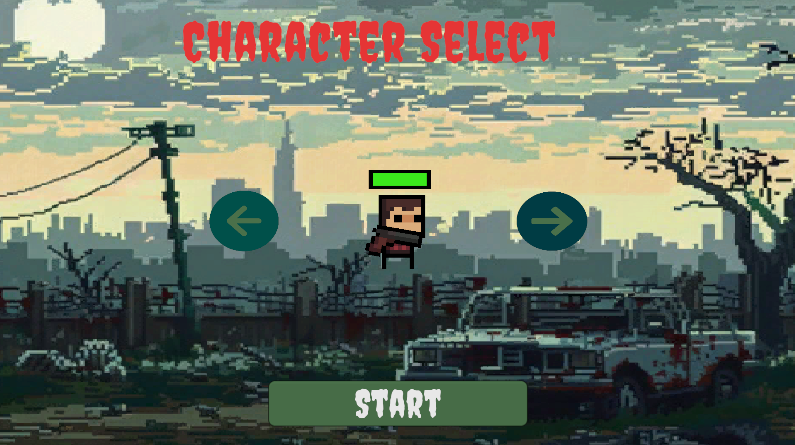
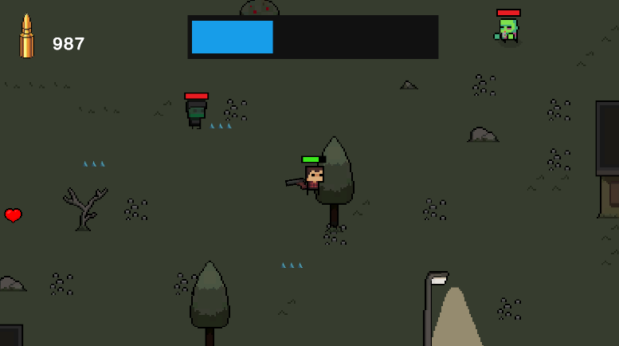
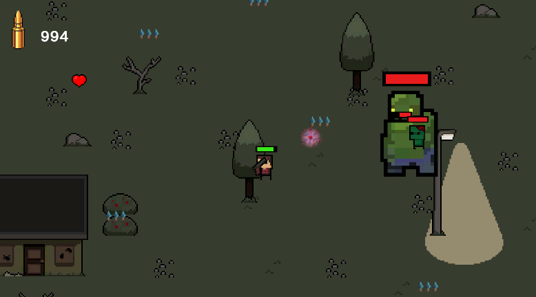

# Agent Phoenix: Genesis Outbreak

## Student Information
- **Student Code:** 22125097 - **Full Name:** Võ Như Thiện
- **Student Code:** 22125079 - **Full Name:** Nguyễn Minh Quân

## Game Introduction
Agent Phoenix: Genesis Outbreak is a 2D zombie survival game. Players control Agent Phoenix, who is immune to a virus that turned humans into zombies. The goal is to collect energy cores, fight different enemy types, and defeat the boss to save humanity.

**Game Features:**
- Top-down 2D shooter
- Multiple enemy types (Basic, Energy, Heal, Explosion, Boss)
- Character selection system  
- Energy collection mechanics
- Boss battles with special attacks

## Unity Version
Unity 2022.3.62f1 LTS

## Controls
- **WASD** - Move character
- **Mouse** - Aim weapon
- **Left Click** - Shoot
- **Right Click** - Reload
- **ESC** - Pause menu

## Resource References
### Sprite
- **itch.io** - Character and tileset
### Audio
- **Juhani Junkala** - Epic Boss Battle music (Creative Commons Attribution 3.0)
- **Freesound.org** - Sound effects (Various Creative Commons licenses)
- **Pixabay** - Game audio and music (Royalty-free)

### Tools
- **Unity Engine** - Game development platform
- **Visual Studio** - Code editor
- **Unity Asset Store** - Additional resources

### Learning Resources
- Unity Documentation
- C# Programming guides
- Game development tutorials
